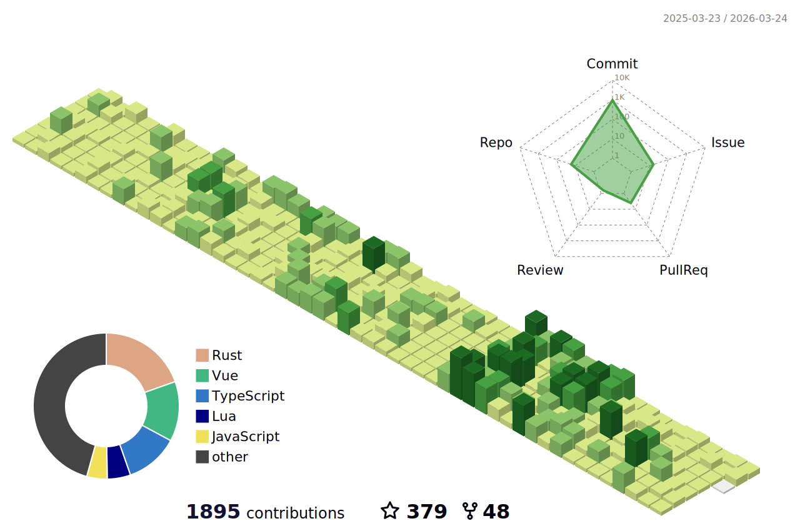

<h1 align="center">Hi 👋, I'm Eigeen</h1>
<h3 align="center">一位兴趣使然的开发者</h3>

- 🌱 经常使用 **Golang, Python, Java**
- 📝 个人博客 [https://www.eigeen.com](https://www.eigeen.com)
- 📫 邮箱 **dengyk2002@qq.com**
- 编程语言不是障碍，需求驱动技术

  

<!--   profile-green-animate -->

&nbsp;

> Part of the content generated by https://github.com/rahuldkjain/github-profile-readme-generator
> 
> Thanks: https://github.com/BEPb/BEPb
